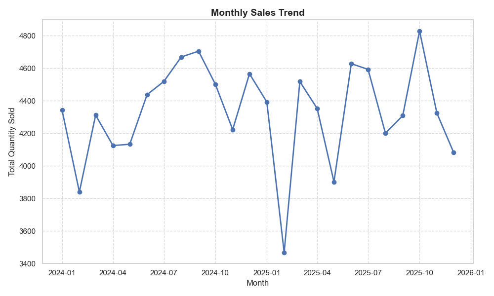
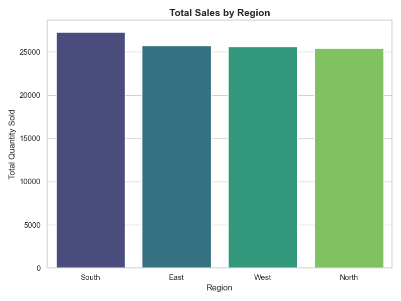

# 📊 Monthly Sales Analysis Report

## Executive Summary
This report provides a comprehensive analysis of sales performance across different regions and months. The data reveals key trends in consumer behavior and regional performance, allowing for data-driven strategic planning.

---

## 📈 Sales Performance Trends

### Monthly Sales Volume
The chart below illustrates the fluctuations in sales quantity throughout the year. 

> [!NOTE]
> The sales trend indicates seasonal variations, which are critical for inventory management and marketing campaign alignment.

### Key Performance Indicators (KPIs)
| Metric | Detail | Value |
| :--- | :--- | :--- |
| **Best Performing Month** | 2025-10 | 4829 units |
| **Least Performing Month** | 2025-02 | 3468 units |
| **Total Units Sold** | 103,975 units | 103,975 units |

---

## 🌍 Regional Breakdown
The regional analysis highlights the distribution of sales across different geographical segments.

### Regional Strategic Insights
- **Top Region:** South
- **Focus Areas:** Strengthen marketing in South (27290 units)

---

## 💡 Strategic Recommendations
1. **Capitalize on Peak Seasons:** Increase marketing spend during high-performing months identified in the trend analysis.
2. **Regional Optimization:** Investigate the factors driving success in the top region and replicate these strategies in underperforming areas.
3. **Inventory Management:** Align stock levels with seasonal demand to minimize holding costs and prevent stockouts.

---

